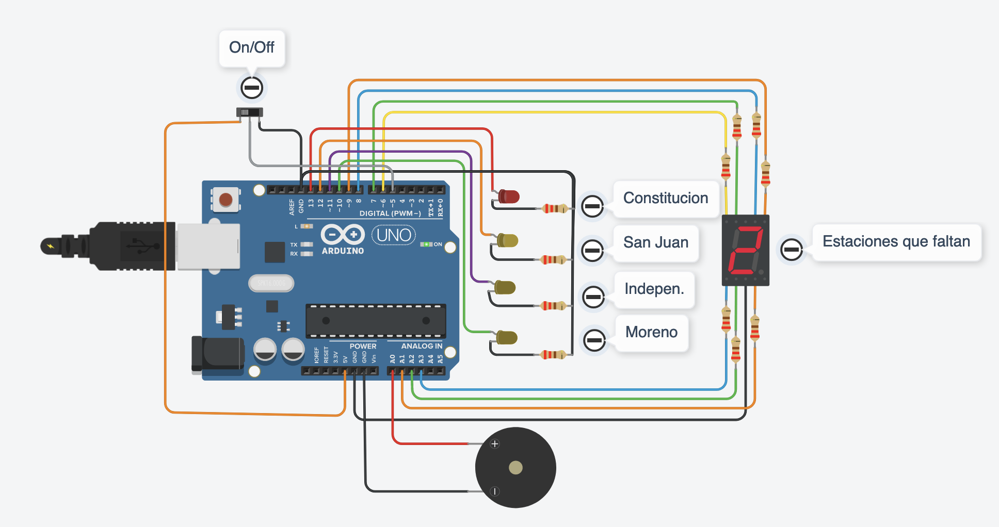

# SPD-UTN MetroStations \ Estaciones de Subte

## Integrantes

- Juan David Chaves Rodriguez

## Proyecto: Estaciones de Subte.



## Descripción

La empresa “UTN FRA Robotics” ganó la licitación de un proyecto, y deberá Implementar un sistema que permita al usuario saber a qué estación de subte está llegando, aparte el sistema muestra las estaciones que faltan hasta llegar a destino, para ello debemos utilizar 4 LEDs y el display de 7 segmentos. Esta vez el buzzer deberá emitir un sonido diferente cada vez que se llegue a una estación.
El sistema deberá arrancar apagado, luego de accionar el interruptor empezará y hará lo pedido.
Deberá recorrer las estaciones comenzando por constitución y mostrará en el display 7 segmentos cuantas estaciones faltan para llegar a moreno, cada vez que llega a una estación realiza un sonido el buzzer.

## Función principal

```C (lenguaje en el que esta escrito)
loop() Es la función principal. En loop() está declarado, por medio de un if, el funcionamiento del Slideswitch.
Cuando este se encuentre encendido se inicia el programa, cuando no, el programa se detiene y se reinicia.

Las funciones printNumber(int number), turnOff(), turnOffLED() encienden y apagan los leds dependiendo del contador de estaciones faltantes.
```

## :robot: Link al proyecto

- [proyecto](https://www.tinkercad.com/things/cLF1x6nioKR?sharecode=zUkFTESgG4W-TzGPthu-ziUg23XjChnR9P5GbU8wdh4)
